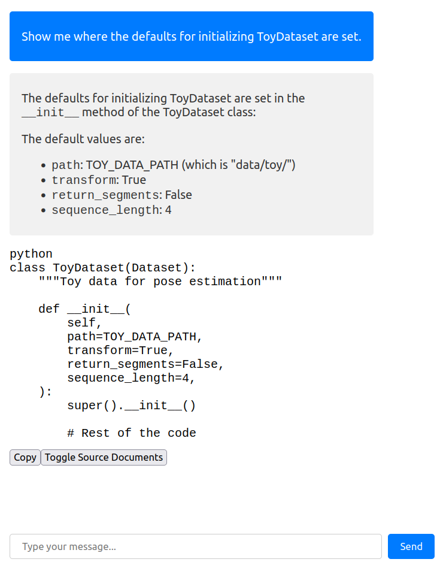

# Ch(e)atCode

ChatGPT for your codebase. Your cheatcode for productivity 🚀.

Fleshed out version of my [proof of concept](https://github.com/rasdani/chat-your-code).

<!--  -->

    

## run CLI app

`python cheatcode.py init` searches recusively for `.py` files in your current directory and creates a `.cheatcode` folder, which stores your embedded source code.

`python cheatcode.py chat` starts the chat on your terminal.

## run web app

`python app.py` starts the web UI on localhost:8000.

You need to init your codebase first.